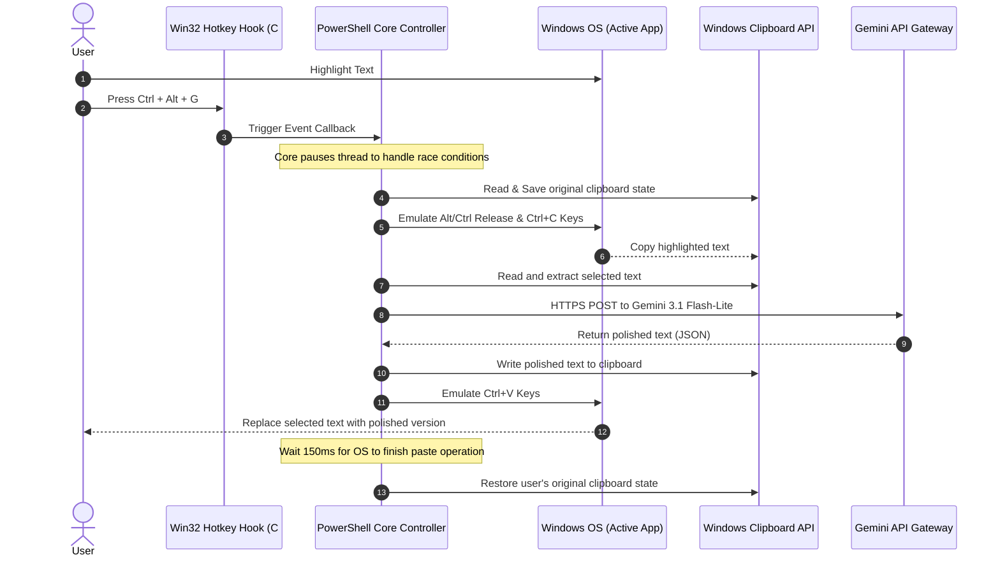

# Technical & Architectural Documentation: SmartPolisher 🛠️🧠

SmartPolisher is a native Windows background service (daemon) designed to enhance selected text anywhere in the operating system using Google's Gemini API (specifically `gemini-3.1-flash-lite`). It is built using **PowerShell 5.1+** and **inline C# .NET compilation**, requiring **zero third-party dependencies** (no Python, Node.js, AutoHotkey, or npm packages required).

---

## 📐 System Architecture

The following diagram illustrates the execution flow from the moment the user triggers the global shortcut to the point where the enhanced text is pasted back.



---

## 💻 Deep-Dive Technical Implementation

### 1. Win32 Global Hotkey Hooking
To intercept keystrokes globally without having an active focused window, the tool registers a hotkey directly with the Windows kernel via the `user32.dll` API.

Since PowerShell does not natively support low-level Win32 DLL imports, we use PowerShell's `Add-Type` compiler to compile a custom C# wrapper class (`HotKeyForm`) on-the-fly:

```csharp
public class HotKeyForm : Form {
    [DllImport("user32.dll")]
    private static extern bool RegisterHotKey(IntPtr hWnd, int id, uint fsModifiers, uint vk);

    [DllImport("user32.dll")]
    private static extern bool UnregisterHotKey(IntPtr hWnd, int id);
    
    // ... registers hotkey inside constructor using Handle
}
```

* **Hotkey Registration (`RegisterHotKey`)**: Hooks into the Win32 message loop (`WndProc`) of a hidden WinForms window.
* **Message Loop Interception**: Captures the `WM_HOTKEY` message (`0x0312`). When triggered, it fires a C# `Action` delegate, which executes our PowerShell script callback.

### 2. Physical Key State & Keystroke Simulation
When a hotkey like `Ctrl + Alt + G` is pressed, the user's fingers are physically holding down `Ctrl` and `Alt`. If we immediately inject a simulated `Ctrl + C` command, the OS combines the physical and virtual states, resulting in a `Ctrl + Alt + C` input, which fails to copy.

To solve this, the compiled C# `KeyboardHelper` forcefully releases physical modifiers before simulating the copy/paste actions:

```csharp
// Force release modifiers before injecting keys
keybd_event(VK_MENU, 0, KEYEVENTF_KEYUP, 0);     // Alt UP
keybd_event(VK_CONTROL, 0, KEYEVENTF_KEYUP, 0);  // Ctrl UP
keybd_event(VK_SHIFT, 0, KEYEVENTF_KEYUP, 0);    // Shift UP

// Inject Ctrl + C
keybd_event(VK_CONTROL, 0, 0, 0);
keybd_event(VK_C, 0, 0, 0);
```

### 3. Thread Synchronization & Clipboard Race Conditions
The Windows Clipboard is a shared resource. During development, a rapid clipboard polling loop caused `ExternalException: Requested Clipboard operation did not succeed` (Clipboard Lock Contention).

This happens because the active target application is opening, writing, and closing the clipboard in response to `Ctrl + C` at the exact same millisecond our PowerShell script is attempting to read it.

#### Solution:
* **Copy Delay**: The script waits exactly `120ms` after simulating the copy command. This gives the target application a safe window to write and close the clipboard before the daemon reads the content.
* **Paste Delay**: After injecting `Ctrl + V`, the script waits `150ms` before restoring the user's original clipboard. If restored too quickly, the target application might paste the *restored* text instead of the *enhanced* text.

### 4. Low-Latency REST API Integration
The daemon communicates directly with the Google Generative Language API. We use `Invoke-RestMethod` which utilizes the underlying .NET connection pool to keep keep-alive connections warm, reducing TCP/TLS handshake latency on subsequent calls.

* **API Endpoint**: `https://generativelanguage.googleapis.com/v1beta/models/gemini-3.1-flash-lite:generateContent`
* **JSON Payload**:
```json
{
  "contents": [
    {
      "parts": [
        {
          "text": "<System_Prompt>\n\nText to improve:\n<Selected_Text>"
        }
      ]
    }
  ]
}
```

#### Performance Benchmarks:
| Model Name | Status | Average Latency (ms) | Recommendation |
| :--- | :--- | :--- | :--- |
| **`gemini-3.1-flash-lite`** | **Success** | **707 ms** | **Best Choice (Fastest)** |
| `gemini-2.5-flash` | Success | 1682 ms | Moderate |
| `gemini-3.5-flash` | Success | 1622 ms | Moderate |
| `gemini-2.0-flash` | Quota Block (429) | N/A | Restricted |
| `gemini-1.5-flash` | Not Found (404) | N/A | Deprecated |

---

## 🔄 Daemon Lifecycle Management

To manage the process silently in the background, we implement a **PID file tracking system**:

1. **Startup (`Start-SmartPolisher.bat`)**: Launches PowerShell silently (`-WindowStyle Hidden`).
2. **Process ID Generation**: The script writes its own process ID (`$PID`) into `smartpolisher.pid`.
3. **Tray Integration**: Creates a Windows notify icon (`NotifyIcon`) next to the clock. Right-clicking the icon provides an "Exit" action that terminates the form event loop.
4. **Shutdown (`Stop-SmartPolisher.bat`)**: Reads the PID from `smartpolisher.pid` and safely terminates only the matching process using `taskkill /f /pid <PID>`, preventing the accidental killing of other PowerShell windows.
